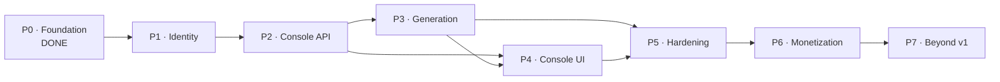

# Roadmap

Drovi builds a working replica of somebody else's production API. You name a product, an
agent researches it, and you get a base URL to paste over the real one.

This document is the **canonical plan across all repos**. Per-phase engineering detail is
in [`../02-implementation/implementation-plan.md`](../02-implementation/implementation-plan.md).

## The shape of the plan

Seven phases. Each ends with something a person can *use* — not a layer that only makes
sense once the next one lands. The order is forced by one dependency chain:

> nothing can be owned until there is an identity · nothing can be managed until there is
> a console API · nothing can be generated until spend can be capped · nothing can be sold
> until limits are enforced

**The v1 cut line is the end of P5.** P0–P5 is a product someone can use for real work.
P6 makes it a business. P7 is everything we deliberately deferred.

---

## Phase 0 — Foundation ✅ complete

**Goal:** prove the core mechanic — that a sandbox can serve a faithful replica.

| Delivered | |
| --- | --- |
| Schema | 18 tables, Flyway, four invariants enforced by the database |
| Mock runtime | routing, rules, LIST/GET/CREATE/UPDATE/DELETE, envelopes, paging, filtering |
| Sandbox auth | NONE / BEARER / HEADER_KEY / BASIC against hashed keys |
| Quota | trigger-maintained counters, enforced on write |
| Inspector | every served call logged, including unmatched routes |
| Tests | 23, green against a real embedded Postgres |

**Exit criteria — met:** a hand-seeded project serves a faithful replica over HTTP, with
rules overriding data and quota refusing writes past the plan limit.

**What it does not do:** anything a user could reach without SQL access.

---

## Phase 1 — Identity and entitlements  🟡 mostly complete

**Goal:** a caller has a name, a plan, and limits that are the server's to decide.

Nothing else can be built first. Every console route needs a principal, and every quota
needs an account to charge.

| Deliverable | Status |
| --- | --- |
| Firebase token verification | ✅ OAuth2 resource server against Firebase's JWK set (ADR-0006) |
| Deny by default | ✅ every route authenticated except `/s/**` and health, each with a stated reason |
| Implicit account provisioning | ✅ on first authenticated call, race-safe |
| `GET /me`, `GET /me/entitlements` | ✅ limits read from `plan_catalog` |
| Error envelope + correlation ids | ✅ one handler; 5xx carries a generic message and an id |
| Usage rollups (`account_usage_month`) | ❌ deferred to Phase 6, where the monthly caps are actually enforced |

**Exit criteria:** a real Firebase user signs in, hits `/me`, sees their plan, and an
unauthenticated call to any console route is rejected. **The first half needs a Firebase
project to exist** — everything else is done and tested.

**The human task shrank.** ADR-0006 means verification needs only the Firebase **project
id**, not a service-account credential. Until one is set the server fails closed:
`AUTH_NOT_CONFIGURED` on every console route, sandboxes unaffected.

---

## Phase 2 — Console API

**Goal:** everything the runtime can do becomes reachable without touching SQL.

This is the phase that makes Phase 0 useful. It is also the last one that is purely
mechanical — after this, cost and correctness get interesting.

| Deliverable | Detail |
| --- | --- |
| Projects | create, list, archive. The base URL is the artifact |
| API keys | issue and revoke; the raw key is returned **once** and never stored |
| Spec browsing | API groups, endpoints, schemas — the Postman-like view |
| Data | browse, edit, bulk-seed records, within quota |
| Rules | create, reorder, enable/disable, one-shot |
| Inspector | a tail of `mock_request_log` per project |

**Exit criteria:** a user creates a project, seeds data, defines a rule, calls their
sandbox, and sees the call in the inspector — entirely over HTTP.

**Watch:** bulk seed is the highest-volume write path in the system. It must stream and
batch, and it must check quota *before* the insert, not after.

---

## Phase 3 — Generation

**Goal:** the headline feature. Describe a product in chat; get a sandbox.

| Deliverable | Detail |
| --- | --- |
| Provider adapter | `geminiProvider`, resolved from `ai_provider_config` |
| Ledger and caps | every call recorded; kill switch and daily caps enforced **before** the call |
| Pipeline | RESEARCH → SPEC → SEED as `generation_job`s with retries |
| Chat | threads, messages, and a tool surface that can only touch the project in scope |
| REVISE | "make five customers' cards blocked" applied to an existing sandbox |

**Exit criteria:** from one sentence — *"mimic Stripe's card API"* — a project reaches
`READY` with endpoints, schemas and seed data, and its base URL serves them.

**The two risks that matter here**, both called out in the security docs:

1. **Spend.** Caps and the kill switch must work *before* the first real generation, not
   after the first surprise bill. Build them in the same change as the adapter.
2. **Prompt injection.** Researched content is untrusted input reaching a model that holds
   database tools. Scope the tool surface structurally — a system prompt is not a control.

---

## Phase 4 — Console UI (Next.js + React + TypeScript)

**Goal:** the product becomes something you would show someone.

| Deliverable | Detail |
| --- | --- |
| Chat | the primary surface; streams a generation's progress |
| Collection browser | API groups → endpoints → schemas |
| Data inspector | the records behind each endpoint, editable |
| Rules | visibly secondary to data — the UI must not suggest scripted responses |
| Traffic inspector | live tail; platform errors visually distinct from simulated ones |
| Project settings | base URL front and centre; keys, auth mode, latency |

**Exit criteria:** a developer completes the whole loop — describe, generate, copy the base
URL, call it from their own app, watch it in the inspector — without reading any docs.

**Deploys to Render or Cloudflare, not Vercel free**: Hobby is non-commercial only, and a
paid tier breaches it (ADR-0005).

---

## Phase 5 — Hardening and operations · **v1 cut line**

**Goal:** it survives real use and real mistakes.

Everything here is a known gap today, and each one is a real incident waiting to happen.

| Deliverable | Why it is not optional |
| --- | --- |
| `mock_request_log` retention purge | the fastest-growing table has **no** purge; it will fill the database first |
| Stuck-job sweeper | `RUNNING` generations never recover without one |
| Rate limiting on `/s/**` | the public surface has no abuse control at all |
| **Per-project error envelope** | today a missing record returns *Drovi's* 404 shape, not the imitated product's — which partly defeats a faithful replica |
| Structured logging + correlation ids | the inspector explains one call; this explains the system |
| Alerting | spend, storage, unmatched-route rate |

**Exit criteria:** a week of real traffic with no manual intervention, and the runbook's
procedures have each been walked once.

---

## Phase 6 — Monetization

**Goal:** the free tier stops being the only tier.

| Deliverable | Detail |
| --- | --- |
| Plan enforcement end to end | project count, endpoints, requests/month, tokens/month |
| Real plan limits and prices | the seeded numbers are placeholders, never a pricing decision |
| Billing integration | provider to be chosen |
| Usage dashboards | storage, requests, model spend, per project |
| Upgrade / downgrade | including what happens to a project that exceeds a lowered limit |

**Exit criteria:** a user upgrades, their limits change immediately, and the change is
server-authoritative.

---

## Phase 7 — Beyond v1

Deliberately deferred. Listed so they are not smuggled into an earlier phase.

| Idea | Note |
| --- | --- |
| **OpenAPI / Postman import** | skip research entirely when the user already has a spec. Probably the highest-value item here |
| **Scenarios** | a named, toggleable set of rules — "declined payments", "peak load" |
| **Outbound webhook simulation** | let a sandbox call *back* into the user's app, as real payment products do |
| **Stateful flows** | a charge that moves `pending → settled` on a schedule |
| **Team accounts** | shared projects, roles |
| **Record templates / faker** | generate 10k realistic rows without 10k model tokens |
| **Self-hosting** | the Dockerfile already makes this cheap |
| **Response fidelity diffing** | call the real API once, diff it against the replica |

---

## What could invalidate this plan

Named now, so a surprise later is recognised rather than debated.

| Risk | Signal it is happening | Response |
| --- | --- | --- |
| **Generation quality is not good enough** | high unmatched-route rate; users correcting endpoints by hand | Phase 7's OpenAPI import moves forward — a supplied spec beats research |
| **Model cost per sandbox is too high for a free tier** | `ai_call` spend per `READY` project | route SEED cheaper; template-generate bulk records instead of prompting for them |
| **512 MB is not enough** | Render OOM kills | $7 instance, or move the runtime off the JVM |
| **Storage fills faster than expected** | Supabase approaching 500 MB | the P5 purge moves into P2 |
| **Prompt injection lands** | a generation mutates something outside its project | stop generation via the kill switch; the tool surface was too broad |
