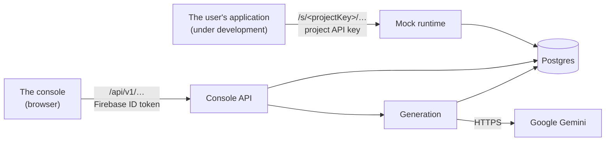

# High-level design

## Shape

A modular monolith, one deployable, sized for a 512 MB / 0.1 CPU instance.

```
com.pm.drovi_backend
├── DroviBackendApplication
├── config/     AppConfigService — the app_config table, cached
├── domain/     entities for the runtime tables
├── repo/       Spring Data repositories
├── runtime/    the mock server: matching, rules, rendering, quota, auth
└── web/        MockController + MockRequestLogger
```

INVARIANT: dependencies point one way — `web → service → repository → domain`.
INVARIANT: `runtime` contains **no servlet types**. `MockRequest` and `MockResponse` are
plain records, so the most important logic in the product is drivable from a unit test.

## Two boundaries



The left path is the unusual one: **the caller is another developer's application**, not a
browser and not a person. That shapes several decisions — a cold start reads as a timeout,
and the response shape must be the imitated product's rather than ours.

## The request path

`SandboxRuntime.handle` is the whole product in one method. The order is the contract, and
each step exists because skipping it produces a specific wrong behaviour.

| # | Step | Skipping it means |
| --- | --- | --- |
| 1 | resolve the project; must be `READY`, not archived | a half-generated sandbox serves nonsense |
| 2 | authenticate per `auth_mode` | the caller's own auth path is never exercised |
| 3 | route — most literal `path_template` wins | `/v1/cards/blocked` hides behind `/v1/cards/{cardId}` |
| 4 | **rules, before data** | an override is meaningless if the data answers first |
| 5 | data — LIST/GET/CREATE/UPDATE/DELETE, or STATIC | — |
| 6 | apply the project's simulated latency | — |

## Components

| Component | Owns |
| --- | --- |
| `RouteMatcher` | template → regex, path params. Caches **compiled patterns**, not the endpoint list |
| `RuleEngine` | matcher evaluation, one-shot consumption via a conditional `UPDATE` |
| `TemplateRenderer` | the response envelope |
| `QuotaService` | storage enforcement; throws rather than returning a boolean |
| `SandboxAuthenticator` | the four auth modes; lookup by hash |
| `SandboxRuntime` | orchestration — the only place that knows the order |

### Why the endpoint list is deliberately not cached

A compiled pattern is a pure function of a template string and can never go stale. The
route table changes the moment the chat adds an endpoint, and a user told their new route
is live must not meet a 404 for the next ten minutes. The lookup is one indexed read —
that is the cheaper thing to spend.

## Transactions

- `@Transactional` on service methods only; `readOnly = true` for reads.
- INVARIANT: **no external HTTP call inside a transaction.** Free-tier pools die holding a
  connection across a network round trip — and generation calls take minutes.
- The request logger runs `REQUIRES_NEW` and swallows its own failures: the log exists to
  explain the response and must never be why a caller does not get one.

## Concurrency

Virtual threads are enabled. That is what makes simulated latency affordable — a delay
parks a continuation instead of pinning a platform thread.

## Deployment

One container on Render, built from the `Dockerfile` on push to `main`. Postgres on
Supabase via the session pooler. Flyway runs at startup, and there is no blue/green — so a
migration must be compatible with the previously running version.

## Why this shape

Small team, one instance, an unsettled domain. Module boundaries are drawn so the runtime
could be extracted later if it needs to scale separately from generation — but extracting
before there is measured pressure would cost far more than it saves.
